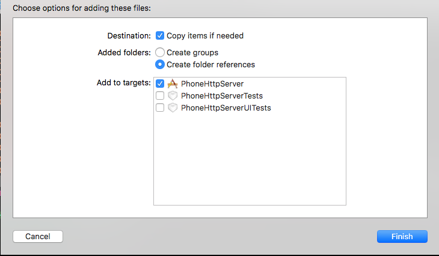

# PhoneHttpServer
手机端开启端口，用浏览器输入打印ip地址，会显示相应的Html界面，此工程是实现上传、查看、删除文件，get/post协议自己定，然后跟前端H5 统一就行，跟我们平时请求服务器一样，返回json等。
把webServer文件夹拖进去， 里面的webServer-xc文件夹删掉重新拖进去，选项如下图所示
项目中的001.png    选择create floder references 也就是拖进工程之后，文件夹是蓝色的！！！！
  图片怎么不显示呢.....~~~~(>_<)~~~~

